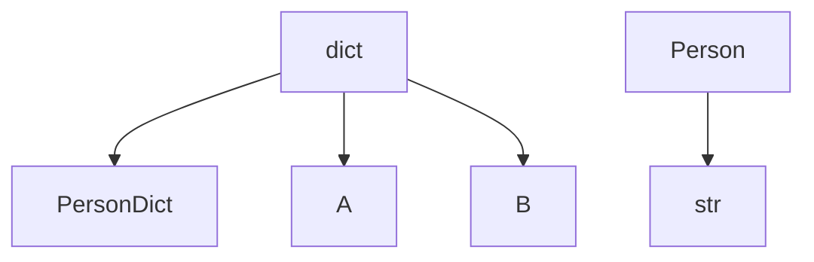
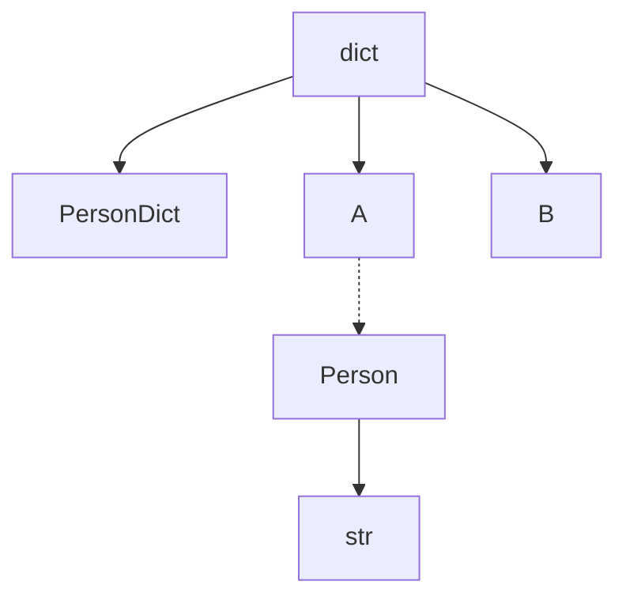
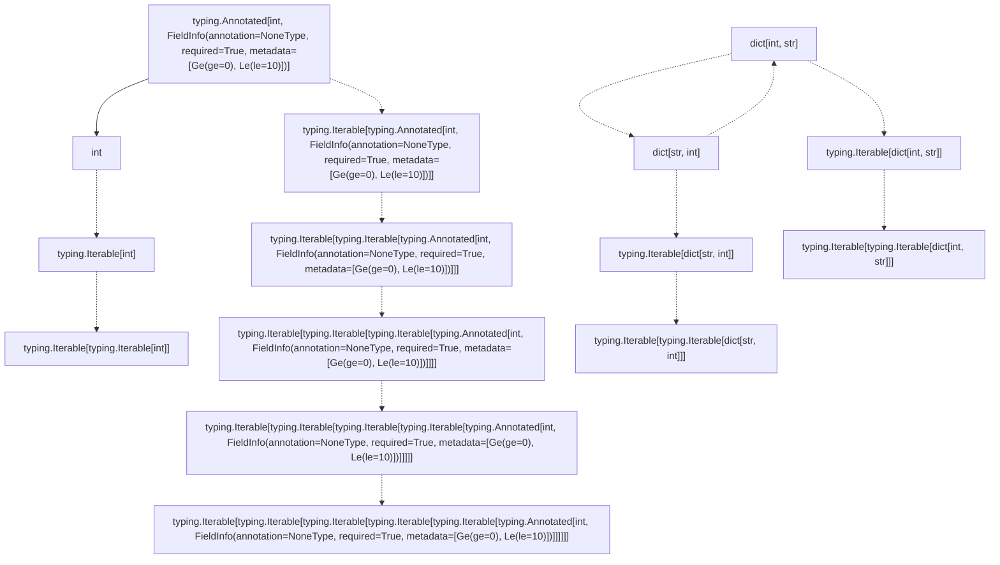
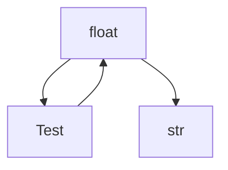

<div align="center">

# TypeGraph

_**TypeGraph** 是一个 Python 库，用于在不同类型之间进行类型转换，括自定义类型、内置类型和结构类型 (如列表、集合和字典), 同时兼容 `Pydantic Annotated[T, Feild(...)]`。它支持同步和异步的转换方法。_

> 蓦然回首，那人却在灯火阑珊处

 [](https://www.codefactor.io/repository/github/luxuncang/typegraph)
 [](https://github.com/luxuncang/typegraph/blob/master/LICENSE)
 [](https://github.com/luxuncang/typegraph/blob/master/.github/workflows/codeql.yml)

简体中文 | [English](./README.md)

</div>

## 功能
- 注册同步和异步函数的类型转换器
- 根据类型注解自动转换函数参数
- 支持子类、联合类型和结构类型的转换
- 递归泛型计算
- 使用 mermaid 语法可视化转换图

## 安装
使用以下命令安装运行该库所需的依赖项：

```sh
pip install typegraph3
```

Or

```sh
pdm add typegraph3
```

## 入门指南

### 示例：同步转换器
注册同步转换器并使用：

```python
from typegraph import PdtConverter

converter = PdtConverter()

@converter.register_converter(int, str)
def int_to_str(value: int) -> str:
    return str(value)

result = converter.convert(10, str)  # "10"
print(result)
```

### 示例：异步转换器
注册异步转换器并使用：

```python
import asyncio
from typegraph import PdtConverter

converter = PdtConverter()

@converter.async_register_converter(str, int)
async def str_to_int(value: str) -> int:
    return int(value)

async def test_async_conversion():
    result = await converter.async_convert("10", int)  # 10
    print(result)

asyncio.run(test_async_conversion())
```

### 实例：协议类型

```python
from typing import Protocol, TypedDict, runtime_checkable
from dataclasses import dataclass

from typegraph import TypeConverter

t = TypeConverter()

class Person(Protocol):
    name: str
    phone: str
    address: str

    def get_name(self) -> str:
        ...

class PersonDict(TypedDict):
    name: str
    phone: str
    address: str

class A:
    name: str
    phone: str
    address: str

    def __init__(self, name: str, phone: str, address: str):
        self.name = name
        self.phone = phone
        self.address = address

    def get_name(self) -> str:
        return self.name

@dataclass
class B:
    name: str
    phone: str
    address: str

@t.register_converter(dict, PersonDict)
def convert_dict_to_persondict(data: dict):
    return PersonDict(
        name=data["name"],
        phone=data["phone"],
        address=data["address"]
    )

@t.register_converter(Person, str)
def convert_person_to_str(data: Person):
    return f"{data.name} {data.phone} {data.address}"

@t.register_converter(dict, A)
def convert_dict_to_a(data: dict):
    return A(data["name"], data["phone"], data["address"])

@t.register_converter(dict, B)
def convert_dict_to_b(data: dict):
    return B(data["name"], data["phone"], data["address"])

@t.auto_convert()
def test(a: str):
    return a

d = {"name": "John", "phone": "123", "address": "123"}

t.convert([d], list[str], debug=True)
```

`t.show_mermaid_graph()`



`t.show_mermaid_graph()`



```bash
Converting dict[str, str] to <class 'str'> using [<class 'dict'>, <class '__main__.A'>, <class '__main__.Person'>, <class 'str'>], <function TypeConverter.get_converter.<locals>.<lambda>.<locals>.<lambda> at 0x7f1f3306fac0>

['John 123 123']
```

### 递归泛型计算
 
> 默认递归两次

```python
from typing import Iterable, TypeVar, Annotated

from pydantic import Field

from typegraph import PdtConverter

t = PdtConverter()

K = TypeVar("K")
V = TypeVar("V")

P = Annotated[int, Field(ge=0, le=10)]

@t.register_generic_converter(dict[K, V], dict[V, K])
def convert_dict_to_dict(value: dict[K, V]) -> dict[V, K]:
    return {v: k for k, v in value.items()}

@t.register_generic_converter(V, Iterable[V])
def convert_to_iterable(value: V) -> Iterable[V]:
    return [value]

@t.register_converter(P, int)
def convert_p_to_int(value: P) -> int:
    return value

try:
    t.convert(11, P)
except Exception as e:
    print(e)
```

**Pydantic Annotated[T, Feild(...)]**

```bash
No converter registered for <class 'int'> to typing.Annotated[int, FieldInfo(annotation=NoneType, required=True, metadata=[Ge(ge=0), Le(le=10)])]
```

```python
t.convert(5, P)
```

```bash
5
```
**dict[K,V]->dict[V,K]**

```python
t.convert({1: "2", 3: "4"}, dict[int, int], debug=True)
```

```bash
Converting dict[int, str] to dict[str, int] using [dict[int, str], dict[str, int]], <function convert_dict_to_dict at 0x7f18e595c3a0>
{'2': 1, '4': 3}
```

**V->Iterable[V]**

```python
t.convert(1, Iterable[Iterable[Iterable[P]]], debug=True)
```

```bash
Converting typing.Annotated[int, FieldInfo(annotation=NoneType, required=True, metadata=[Ge(ge=0), Le(le=10)])] to typing.Iterable[typing.Iterable[typing.Iterable[typing.Annotated[int, FieldInfo(annotation=NoneType, required=True, metadata=[Ge(ge=0), Le(le=10)])]]]] using [typing.Annotated[int, FieldInfo(annotation=NoneType, required=True, metadata=[Ge(ge=0), Le(le=10)])], typing.Iterable[typing.Annotated[int, FieldInfo(annotation=NoneType, required=True, metadata=[Ge(ge=0), Le(le=10)])]], typing.Iterable[typing.Iterable[typing.Annotated[int, FieldInfo(annotation=NoneType, required=True, metadata=[Ge(ge=0), Le(le=10)])]]], typing.Iterable[typing.Iterable[typing.Iterable[typing.Annotated[int, FieldInfo(annotation=NoneType, required=True, metadata=[Ge(ge=0), Le(le=10)])]]]]], <function PdtConverter.get_converter.<locals>.<lambda>.<locals>.<lambda> at 0x7f18e46ecf70>
[[[1]]]
```

**可视化**

```python
t.show_mermaid_graph()
```



### 自动转换装饰器
根据类型注解自动转换函数参数：

#### 同步

```python
from typegraph import PdtConverter

converter = PdtConverter()

@converter.register_converter(str, int)
def str_to_int(value: str) -> int:
    return int(value)

@converter.auto_convert()
def add_one(x: int) -> int:
    return x + 1

result = add_one("10")  # 11
print(result)
```

#### 异步

```python
from typegraph import PdtConverter
import asyncio

converter = PdtConverter()

@converter.async_register_converter(str, int)
async def str_to_int(value: str) -> int:
    return int(value)

@converter.async_auto_convert()
async def add_one(x: int) -> int:
    return x + 1

async def test_async():
    result = await add_one("10")  # 11
    print(result)

asyncio.run(test_async())
```

## 测试

提供了单元测试，以确保库的正确功能。运行测试：

```bash
pdm test
```

测试覆盖了：
- 同步转换器的注册与执行。
- 异步转换器的注册与执行。
- 转换能力检查。
- 函数参数的自动转换（同步和异步）。

## 可视化

您可以可视化类型转换图：

```python
from typegraph import PdtConverter

t = PdtConverter()

class Test:
    def __init__(self, t):
        self.t = t

@t.register_converter(float, Test)
def str_to_Test(input_value):
    return Test(input_value)

@t.register_converter(Test, float)
def B_to_float(input_value):
    return float(input_value.t)

@t.register_converter(float, str)
async def float_to_str(input_value):
    return str(input_value)

t.show_mermaid_graph()
```




图将使用 mermaid 语法显示，您可以在线渲染或在支持的环境中（如 Jupyter Notebooks）进行渲染。

## 支持的类型

- [X] 子类类型 (SubClass type)
- [X] 联合类型 (Union type)
- [X] 注解类型 (Annotated type) `Pydantic Annotated[T, Feild(...)]`
- [X] 结构类型 (Structural type)
- [X] 协议类型 (Protocol type)
- [X] 字典类型 (TypedDict type)
- [X] 泛型类型 (Generic type)
- [X] 数据类 (Dataclass/BaseModel)

## 许可
此项目使用 MIT 许可证。

## 贡献
欢迎贡献！请提出 issue 或提交 pull request 来进行更改。

## 联系方式
如果您有任何问题或疑问，请在此仓库中提出 issue。
