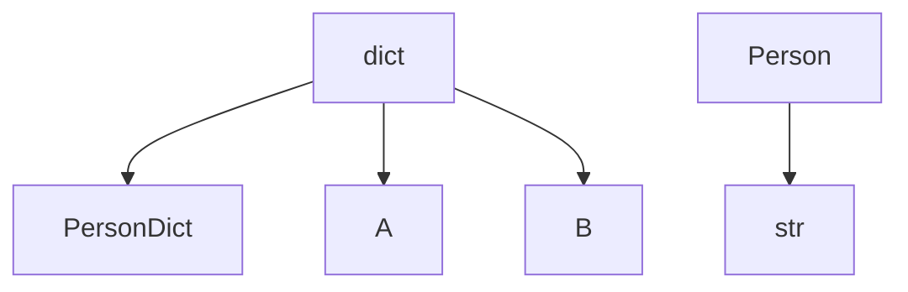
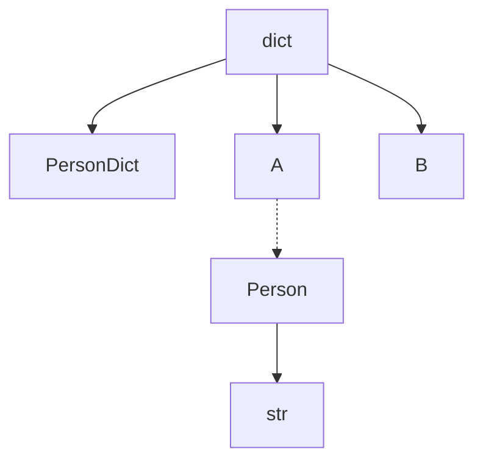
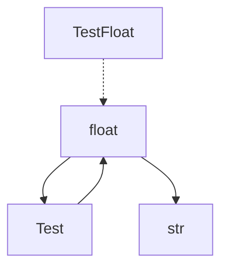

<div align="center">

# TypeGraph

_**TypeGraph** is a Python library designed for type conversion between various types, including custom types, built-in types, and structural types (such as lists, sets, and dictionaries). It supports both synchronous and asynchronous conversion methods._

> 蓦然回首，那人却在灯火阑珊处

 [](https://www.codefactor.io/repository/github/luxuncang/typegraph)
 [](https://github.com/luxuncang/typegraph/blob/master/LICENSE)
 [](https://github.com/luxuncang/typegraph/blob/master/.github/workflows/codeql.yml)

English | [简体中文](./README-zh.md)

</div>

## Features
- Register type converters for synchronous and asynchronous functions.
- Automatically convert function arguments based on type annotations.
- Support for subclass, union types, and structural types conversion.
- Visualize the conversion graph using mermaid syntax.

## Installation
Install the required dependencies with the following command:

```sh
pip install typegraph3
```

Or

```sh
pdm add typegraph3
```

## Getting Started

### Example: Synchronous Converter
Register and use a synchronous converter:

```python
from typegraph import TypeConverter

converter = TypeConverter()

@converter.register_converter(int, str)
def int_to_str(value: int) -> str:
    return str(value)

result = converter.convert(10, str)  # "10"
print(result)
```

### Example: Asynchronous Converter
Register and use an asynchronous converter:

```python
import asyncio
from typegraph import TypeConverter

converter = TypeConverter()

@converter.async_register_converter(str, int)
async def str_to_int(value: str) -> int:
    return int(value)

async def test_async_conversion():
    result = await converter.async_convert("10", int)  # 10
    print(result)

asyncio.run(test_async_conversion())
```

### Example: Protocol Types

```python
from typing import Protocol, TypedDict, runtime_checkable
from dataclasses import dataclass

from typegraph import TypeConverter

t = TypeConverter()

class Person(Protocol):
    name: str
    phone: str
    address: str

    def get_name(self) -> str:
        ...

class PersonDict(TypedDict):
    name: str
    phone: str
    address: str

class A:
    name: str
    phone: str
    address: str

    def __init__(self, name: str, phone: str, address: str):
        self.name = name
        self.phone = phone
        self.address = address

    def get_name(self) -> str:
        return self.name

@dataclass
class B:
    name: str
    phone: str
    address: str

@t.register_converter(dict, PersonDict)
def convert_dict_to_persondict(data: dict):
    return PersonDict(
        name=data["name"],
        phone=data["phone"],
        address=data["address"]
    )

@t.register_converter(Person, str)
def convert_person_to_str(data: Person):
    return f"{data.name} {data.phone} {data.address}"

@t.register_converter(dict, A)
def convert_dict_to_a(data: dict):
    return A(data["name"], data["phone"], data["address"])

@t.register_converter(dict, B)
def convert_dict_to_b(data: dict):
    return B(data["name"], data["phone"], data["address"])

@t.auto_convert()
def test(a: str):
    return a

d = {"name": "John", "phone": "123", "address": "123"}

t.convert([d], list[str], debug=True, protocol=True)
```

`t.show_mermaid_graph()`



`t.show_mermaid_graph(protocol=True)`



```bash
Converting dict[str, str] to <class 'str'> using [<class 'dict'>, <class '__main__.A'>, <class '__main__.Person'>, <class 'str'>], <function TypeConverter.get_converter.<locals>.<lambda>.<locals>.<lambda> at 0x7f1f3306fac0>

['John 123 123']
```

### Auto-Convert Decorator
Automatically convert function arguments based on type annotations:

#### Synchronous

```python
from typegraph import TypeConverter

converter = TypeConverter()

@converter.register_converter(str, int)
def str_to_int(value: str) -> int:
    return int(value)

@converter.auto_convert()
def add_one(x: int) -> int:
    return x + 1

result = add_one("10")  # 11
print(result)
```

#### Asynchronous

```python
from typegraph import TypeConverter
import asyncio

converter = TypeConverter()

@converter.async_register_converter(str, int)
async def str_to_int(value: str) -> int:
    return int(value)

@converter.async_auto_convert()
async def add_one(x: int) -> int:
    return x + 1

async def test_async():
    result = await add_one("10")  # 11
    print(result)

asyncio.run(test_async())
```

## Testing

Unit tests are provided to ensure the library functions correctly. Run the tests:

```bash
pytest test_switch.py
```

Tests cover:
- Registration and execution of synchronous converters.
- Registration and execution of asynchronous converters.
- Conversion capability checks.
- Automatic conversion of function arguments (both synchronous and asynchronous).

## Visualization

You can visualize the type conversion graph:

```python
from typegraph import TypeConverter

t = TypeConverter()

class Test:
    def __init__(self, t):
        self.t = t

class TestFloat(float):
    ...


@t.register_converter(float, Test)
def str_to_Test(input_value):
    return Test(input_value)

@t.register_converter(Test, float)
def B_to_float(input_value):
    return float(input_value.t)

@t.register_converter(float, str)
async def float_to_str(input_value):
    return str(input_value)

t.show_mermaid_graph(subclass=True)
```



The graph will be displayed using mermaid syntax, which can be rendered online or in supported environments like Jupyter Notebooks.

## Supported Types

- [X] Subclass type
- [X] Union type
- [X] Annotated type
- [X] Structural type
- [X] Protocol type (input types only)
- [X] TypedDict type
- [X] Generic type

## License
This project is licensed under the MIT License.

## Contributing
Contributions are welcome! Please open an issue or submit a pull request for any changes.

## Contact
If you have any questions or concerns, please open an issue in this repository.